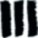

# PAC2 | Projecte Web - Cinema i Lletres



**Descripció:**  
Aquest projecte web simula el lloc oficial de *Cinema i Lletres*, un club cultural dedicat a explorar la connexió entre el món de la literatura i el cinema. El lloc està compost per quatre pàgines interconnectades que presenten informació sobre l'organització, les seves activitats i un formulari de contacte.

---

## 🚀 Tecnologies utilitzades

- **HTML5**: Estructura semàntica de les pàgines.
- **CSS3**: Estils visuals, layout i interacció.
- **Favicon**: Icona visible a la pestanya del navegador.

---

## 📄 Pàgines del projecte

### 1. `index.html` - Pàgina inicial

Pàgina d’entrada amb una presentació breu de l’organització. Es mostra el nom del lloc, menú de navegació, frases identificatives i peu de pàgina amb autoria. El contingut no ha d’excedir el 100% del viewport.

### 2. `nosaltres.html` - Qui som

Descripció del club dividida en quatre seccions amb continguts textuals. Inclou un titular, un lema i una estructura clara basada en els mockups.

### 3. `activitats.html` - Activitats

Taula d’activitats amb informació accessible i ben estructurada. Aquesta pàgina inclou també el lema i el titular de secció, seguint la línia gràfica marcada.

### 4. `formulari.html` - Contacte

Formulari de contacte organitzat per grups de camps. Inclou validacions HTML5 i ús correcte dels tipus de camps. No hi ha cap funcionalitat de processament de dades; només estructura i estils.

---

## 🗂️ Estructura del projecte

```text
Cinema-i-Lletres/
│
├── index.html
├── nosaltres.html
├── activitats.html
├── formulari.html
│
├── css/
│   └── estils.css
│
└── img/
    ├── favicon.png
    ├── fons-index.jpg
    ├── icona1.png
    ├── icona2.png
    └── ...
```

---

## ⚙️ Com visualitzar el projecte

1. Descomprimeix l’arxiu **MaterialsPAC2.zip** si encara no ho has fet.
2. Obre el fitxer `index.html` amb qualsevol navegador modern.
3. Navega pel lloc mitjançant el menú superior.

---

## ✅ Validació i accessibilitat

Aquest lloc web ha estat desenvolupat seguint els criteris d'accessibilitat i està validat amb:

- [W3C HTML Validator](https://validator.w3.org/)
- [W3C CSS Validator](https://jigsaw.w3.org/css-validator/)

---

## 🧾 Documentació extra

Es lliura un document explicatiu (PDF/ODT/DOCX) que inclou:

- Ús de les etiquetes HTML aplicades i per què.
- Selecció de propietats i selectors CSS utilitzats.
- Justificació de possibles diferències amb els mockups originals.

---

## 👨‍💻 Autor

- **Nom:** Jordi Balcells Saenz  
- **Assignatura:** M4.252 - HTML i CSS, UOC  
- **Curs:** 2024–2025  
- **Correu:** [jbalcellss@uoc.edu](mailto:jbalcellss@uoc.edu)

---

### UOC, 2025. Jordi Balcells Saenz | Assignatura: M4.252 - HTML i CSS, UOC
